# Information
- Name: Disha T V
- College Name: Adichunchanagiri Institute Of Technology, Chikkamagaluru
- Contact Number: 9353140736

# Employee Attendance System

A complete, production-ready Employee Attendance System built with React, Node.js, Express, and MongoDB. Features role-based access control for Employees and Managers with comprehensive attendance tracking, reporting, and analytics.

## Features

### Employee Features
- ✅ User Registration & Login
- ✅ Check In / Check Out functionality
- ✅ View personal attendance history with calendar view
- ✅ Monthly attendance summary (Present/Absent/Late/Half-day)
- ✅ Dashboard with today's status, monthly stats, and last 7 days history
- ✅ Profile management with photo upload
- ✅ **Leave Management System**
  - Submit leave requests with file attachments
  - View leave balance for all leave types
  - Color-coded leave calendar
  - Complete leave history with status tracking
  - Half-day leave support
  - Leave delegation feature
- ✅ **Real-time Notifications**
  - Notification bell with unread count
  - Leave approval/rejection notifications
  - Leave status change alerts
  - Mark as read/unread functionality
- ✅ Gamification System
  - Badge achievements for attendance milestones
  - Streak tracking (current and longest)
  - Badge gallery in profile

### Manager Features

### Manager Credential:
- Email: manager@company.com
- Password: manager123


- ✅ Manager Login
- ✅ Dashboard with team overview (total employees, today's attendance, late arrivals, absent list)
- ✅ View all employees' attendance with advanced filters
- ✅ Team calendar view with color-coded attendance
- ✅ Department-wise statistics and charts
- ✅ Weekly attendance trend charts
- ✅ Export attendance reports to CSV
- ✅ **Leave Approval System**
  - Pending leave requests dashboard
  - Approve/Reject/Hold leave requests
  - Department conflict detection
  - Manager remarks on leave requests
  - Today's leaves overview
  - Leave analytics and reports
  - CSV export for leave data
- ✅ **Leave Type Management**
  - Create and manage custom leave types
  - Set yearly quotas and carry-forward rules
  - Configure attachment requirements
- ✅ **Notifications**
  - New leave request notifications
  - Team leave status updates

## Tech Stack

### Frontend
- **React 18** - UI library
- **Vite** - Build tool
- **Redux Toolkit** - State management
- **React Router** - Routing
- **Tailwind CSS** - Styling
- **Recharts** - Charts and graphs
- **React Calendar** - Calendar component
- **Axios** - HTTP client
- **date-fns** - Date utilities

### Backend
- **Node.js** - Runtime
- **Express** - Web framework
- **MongoDB** - Database
- **Mongoose** - ODM
- **JWT** - Authentication
- **bcryptjs** - Password hashing
- **express-validator** - Input validation

## Screenshots

### Frontend Overview

#### Landing Page
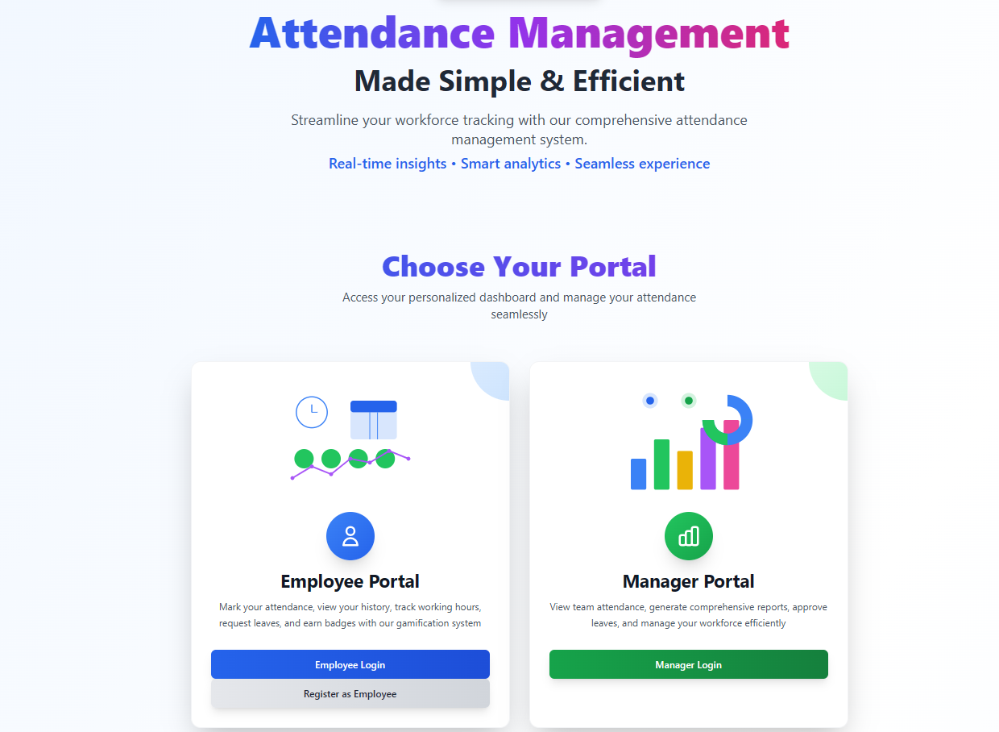
*Welcome page with login and registration options*

#### Employee Dashboard
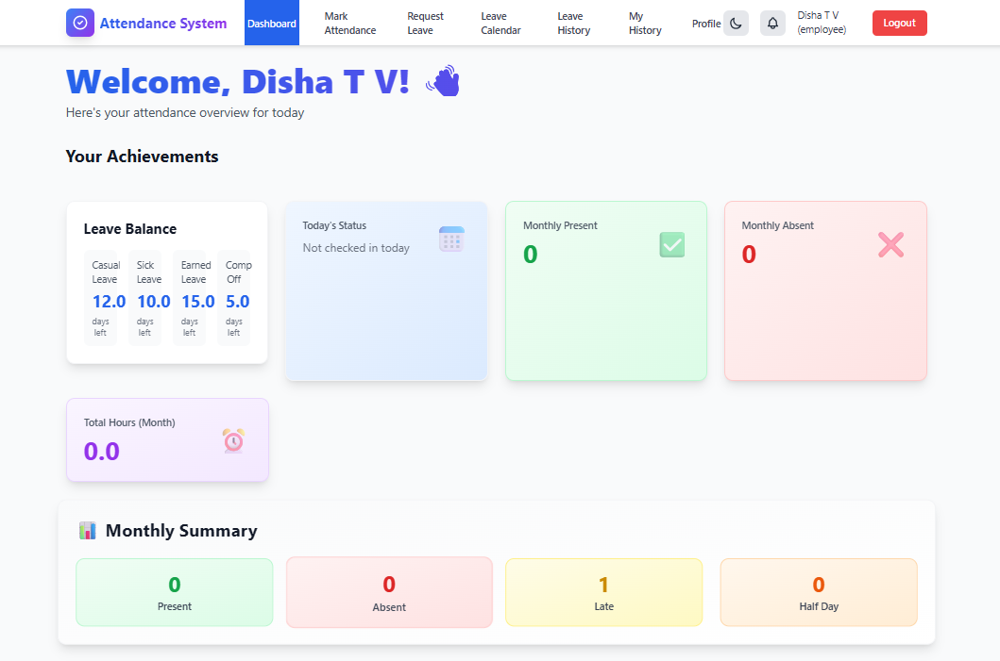
*Employee dashboard showing today's attendance status, monthly statistics, and recent history*

#### Manager Dashboard
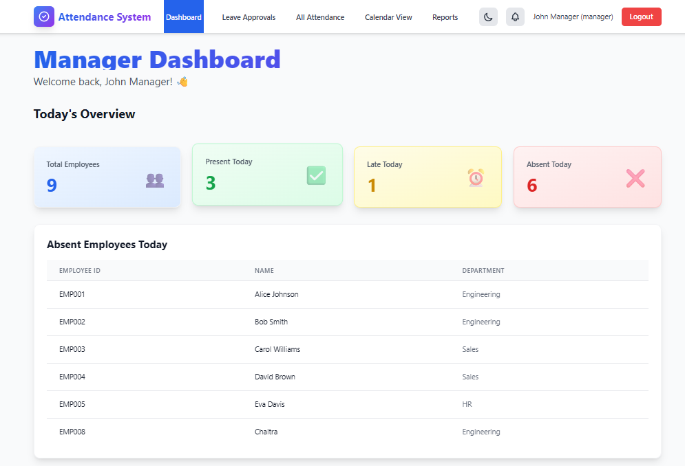
*Manager dashboard with team overview, attendance statistics, and analytics*

### Working Application
Available at - https://eas-frontend-54ymzwkmv-gowdadisha7-gmailcoms-projects.vercel.app/

#### Attendance Marking
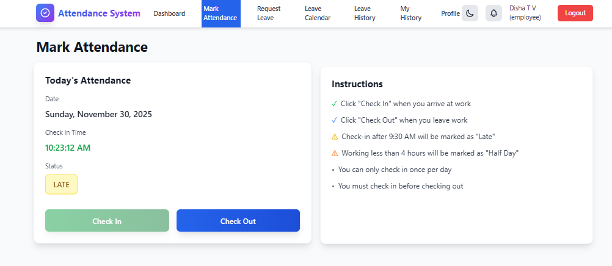
*Check-in/Check-out interface for employees*

#### Attendance History
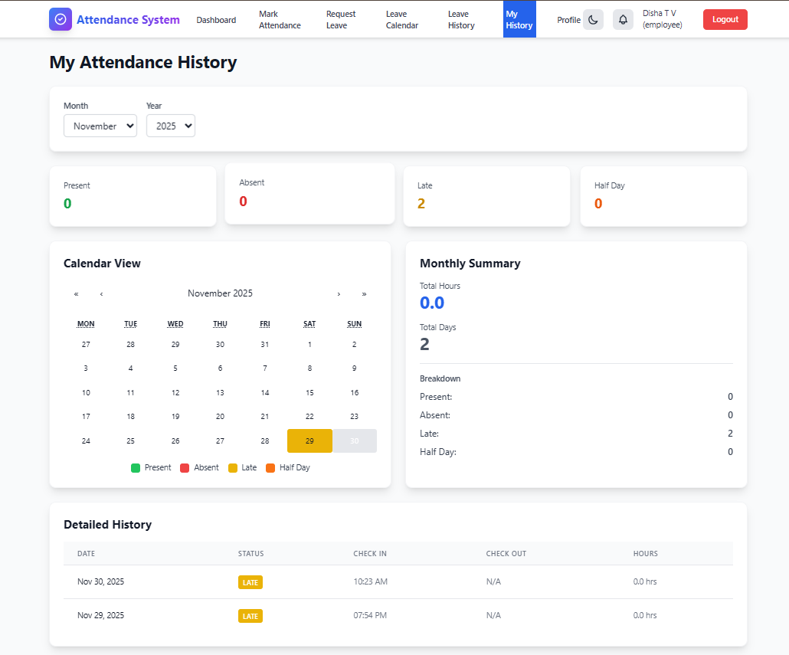
*Calendar view showing attendance history with color-coded status*

#### Team Calendar View
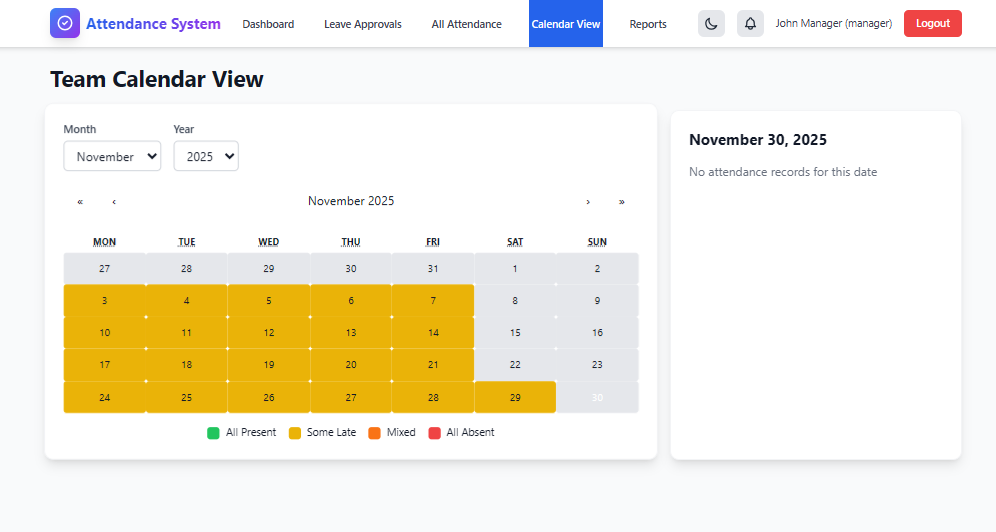
*Manager view of team attendance calendar*

#### Reports & Analytics
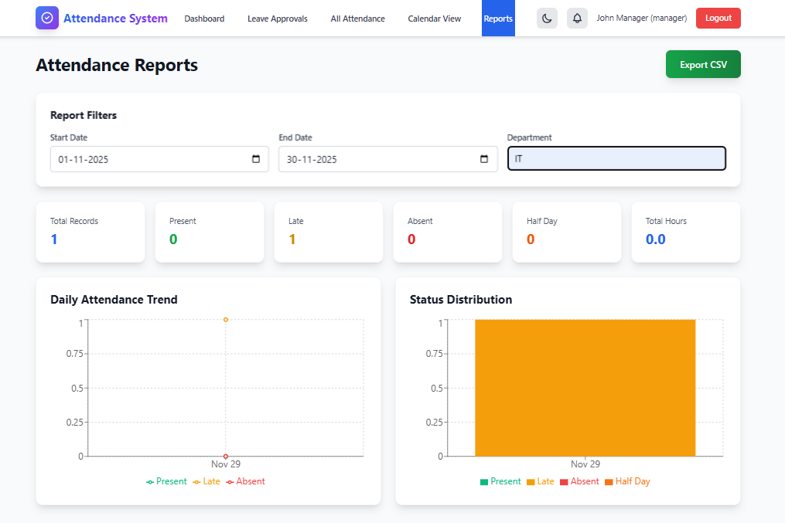
*Analytics dashboard with charts and export functionality*

### Leave Management System

#### Leave Request Form
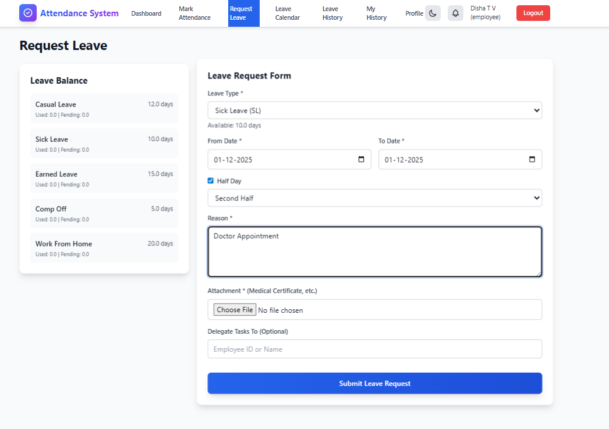
*Employee leave request form with leave type selection, date picker, and file attachment*

#### Leave Calendar View
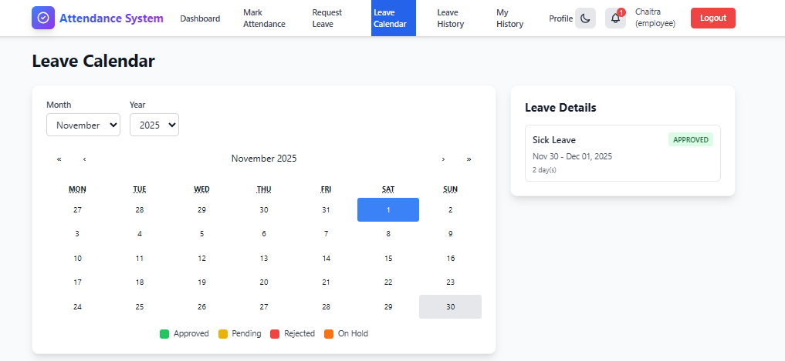
*Color-coded leave calendar showing approved (green), pending (yellow), rejected (red), and on-hold (orange) leaves*

#### Leave History
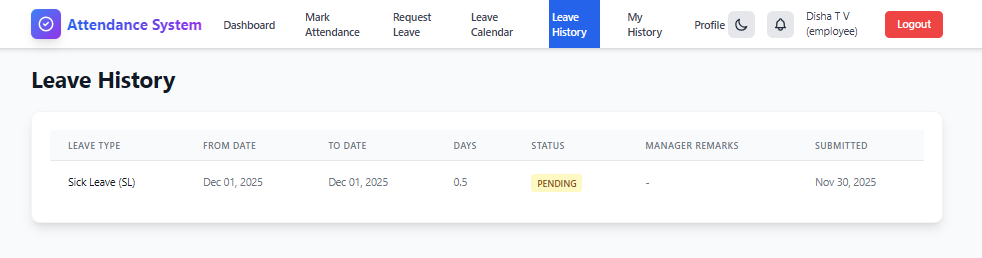
*Complete leave history with status tracking, manager remarks, and timeline view*

#### Manager Leave Approvals
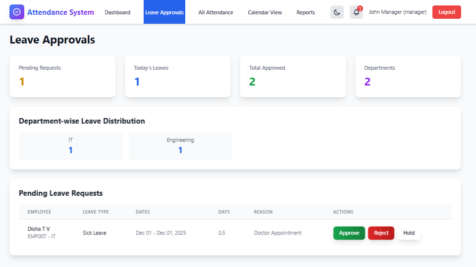
*Manager dashboard for reviewing and approving leave requests with conflict detection*

#### Leave Notification Display
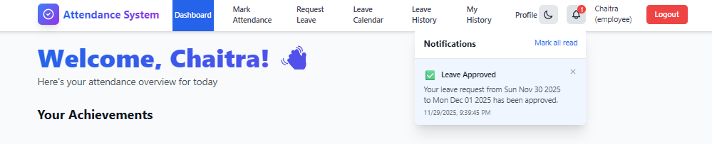
*Employee getting notified about the status of leave*

#### Notification System
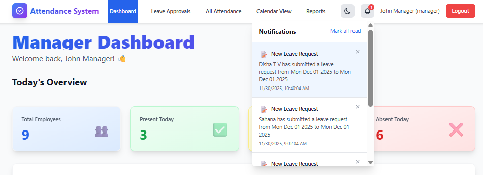
*Real-time notification bell with unread count and notification dropdown*

---

**Note:** To add screenshots, place your image files in a `screenshots/` folder in the project root and update the file names above to match your actual screenshot files.

## Project Structure

```
Employee_Attendence_System/
├── backend/
│   ├── models/
│   │   ├── User.js
│   │   ├── Attendance.js
│   │   ├── Leave.js
│   │   ├── LeaveType.js
│   │   ├── LeaveBalance.js
│   │   └── Notification.js
│   ├── routes/
│   │   ├── auth.js
│   │   ├── attendance.js
│   │   ├── dashboard.js
│   │   ├── leaves.js
│   │   ├── leaveTypes.js
│   │   ├── leaveAnalytics.js
│   │   ├── notifications.js
│   │   ├── badges.js
│   │   └── profile.js
│   ├── middleware/
│   │   └── auth.js
│   ├── scripts/
│   │   └── seed.js
│   ├── server.js
│   ├── package.json
│   └── .env.example
├── frontend/
│   ├── src/
│   │   ├── components/
│   │   │   ├── Layout.jsx
│   │   │   ├── Card.jsx
│   │   │   ├── Button.jsx
│   │   │   ├── Alert.jsx
│   │   │   ├── LoadingSpinner.jsx
│   │   │   ├── PrivateRoute.jsx
│   │   │   ├── NotificationBell.jsx
│   │   │   ├── BadgeCard.jsx
│   │   │   └── BadgeGallery.jsx
│   │   ├── pages/
│   │   │   ├── employee/
│   │   │   │   ├── EmployeeLogin.jsx
│   │   │   │   ├── EmployeeRegister.jsx
│   │   │   │   ├── EmployeeDashboard.jsx
│   │   │   │   ├── MarkAttendance.jsx
│   │   │   │   ├── MyAttendanceHistory.jsx
│   │   │   │   ├── EmployeeProfile.jsx
│   │   │   │   ├── LeaveRequest.jsx
│   │   │   │   ├── LeaveCalendar.jsx
│   │   │   │   └── LeaveHistory.jsx
│   │   │   └── manager/
│   │   │       ├── ManagerLogin.jsx
│   │   │       ├── ManagerDashboard.jsx
│   │   │       ├── AllEmployeesAttendance.jsx
│   │   │       ├── TeamCalendarView.jsx
│   │   │       ├── Reports.jsx
│   │   │       └── LeaveApprovals.jsx
│   │   ├── store/
│   │   │   ├── store.js
│   │   │   └── slices/
│   │   │       ├── authSlice.js
│   │   │       ├── attendanceSlice.js
│   │   │       ├── leaveSlice.js
│   │   │       ├── leaveTypeSlice.js
│   │   │       ├── notificationSlice.js
│   │   │       └── badgeSlice.js
│   │   ├── App.jsx
│   │   ├── main.jsx
│   │   └── index.css
│   ├── index.html
│   ├── package.json
│   ├── vite.config.js
│   ├── tailwind.config.js
│   └── postcss.config.js
└── README.md
```

## Prerequisites

- Node.js (v16 or higher)
- MongoDB (v5 or higher) - Make sure MongoDB is running
- npm or yarn

## Installation

### 1. Clone the repository

```bash
git clone <repository-url>
cd Employee_Attendence_System
```

### 2. Backend Setup

```bash
cd backend
npm install
```

Create a `.env` file in the `backend` directory:

```env
PORT=5000
NODE_ENV=development
MONGODB_URI=mongodb://localhost:27017/employee_attendance
JWT_SECRET=your_super_secret_jwt_key_change_this_in_production
JWT_EXPIRE=7d
```

### 3. Frontend Setup

```bash
cd ../frontend
npm install
```

Create a `.env` file in the `frontend` directory (optional):

```env
VITE_API_URL=http://localhost:5000/api
```

### 4. Seed Database (Optional)

To populate the database with sample data:

```bash
cd backend
npm run seed
```

This will create:
- 1 Manager account: `manager@company.com` / `manager123`
- 5 Employee accounts: `alice@company.com`, `bob@company.com`, etc. / `employee123`
- Sample attendance records for the last 30 days

### 5. Seed Leave Types (Optional)

To populate default leave types:

```bash
cd backend
node scripts/seedLeaveTypes.js
```

This will create default leave types:
- Casual Leave (CL) - 12 days/year
- Sick Leave (SL) - 10 days/year
- Earned Leave (EL) - 15 days/year
- Compensatory Off (CO) - Variable
- Work From Home (WFH) - Variable

## Running the Application

### Start Backend Server

```bash
cd backend
npm run dev
```

The backend server will run on `http://localhost:5000`

### Start Frontend Development Server

```bash
cd frontend
npm run dev
```

The frontend will run on `http://localhost:3000`

## API Endpoints

### Authentication
- `POST /api/auth/register` - Register new employee
- `POST /api/auth/login` - Login user
- `GET /api/auth/me` - Get current user (Protected)

### Attendance (Employee)
- `POST /api/attendance/checkin` - Check in (Protected)
- `POST /api/attendance/checkout` - Check out (Protected)
- `GET /api/attendance/today` - Get today's status (Protected)
- `GET /api/attendance/my-history` - Get attendance history (Protected)
- `GET /api/attendance/my-summary` - Get monthly summary (Protected)

### Attendance (Manager)
- `GET /api/attendance/all` - Get all attendance (Protected, Manager only)
- `GET /api/attendance/employee/:id` - Get employee attendance (Protected, Manager only)
- `GET /api/attendance/summary` - Get team summary (Protected, Manager only)
- `GET /api/attendance/today-status` - Get today's status for all (Protected, Manager only)
- `GET /api/attendance/export` - Export CSV (Protected, Manager only)

### Dashboard
- `GET /api/dashboard/employee` - Employee dashboard data (Protected)
- `GET /api/dashboard/manager` - Manager dashboard data (Protected, Manager only)

### Leave Management (Employee)
- `POST /api/leaves/request` - Submit leave request (Protected)
- `GET /api/leaves/my-leaves` - Get employee's leave history (Protected)
- `GET /api/leaves/balance` - Get leave balance (Protected)
- `GET /api/leaves/calendar` - Get leave calendar (Protected)

### Leave Management (Manager)
- `GET /api/leaves/pending` - Get pending leave requests (Protected, Manager only)
- `GET /api/leaves/all` - Get all leaves (Protected, Manager only)
- `PUT /api/leaves/:id/approve` - Approve leave (Protected, Manager only)
- `PUT /api/leaves/:id/reject` - Reject leave (Protected, Manager only)
- `PUT /api/leaves/:id/hold` - Put leave on hold (Protected, Manager only)
- `GET /api/leave-analytics/manager` - Manager leave analytics (Protected, Manager only)
- `GET /api/leave-analytics/export` - Export leave data (CSV/JSON) (Protected, Manager only)

### Leave Types
- `GET /api/leave-types` - Get all leave types (Protected)
- `POST /api/leave-types` - Create leave type (Protected, Manager only)
- `PUT /api/leave-types/:id` - Update leave type (Protected, Manager only)
- `DELETE /api/leave-types/:id` - Delete leave type (Protected, Manager only)

### Notifications
- `GET /api/notifications` - Get user notifications (Protected)
- `PUT /api/notifications/:id/read` - Mark notification as read (Protected)
- `PUT /api/notifications/read-all` - Mark all notifications as read (Protected)
- `DELETE /api/notifications/:id` - Delete notification (Protected)

### Profile & Badges
- `GET /api/profile/me` - Get user profile with statistics (Protected)
- `PUT /api/profile/me` - Update profile (Protected)
- `GET /api/badges/me` - Get user badges and streaks (Protected)

## Database Schema

### User Model
```javascript
{
  name: String,
  email: String (unique),
  password: String (hashed),
  role: String (enum: 'employee' | 'manager'),
  employeeId: String (unique, auto-generated),
  department: String,
  createdAt: Date
}
```

### Attendance Model
```javascript
{
  userId: ObjectId (ref: User),
  date: Date,
  checkInTime: Date,
  checkOutTime: Date,
  status: String (enum: 'present' | 'absent' | 'late' | 'half-day'),
  totalHours: Number,
  createdAt: Date
}
```

### Leave Model
```javascript
{
  userId: ObjectId (ref: User),
  leaveType: ObjectId (ref: LeaveType),
  fromDate: Date,
  toDate: Date,
  reason: String,
  status: String (enum: 'pending' | 'approved' | 'rejected' | 'on-hold'),
  managerRemarks: String,
  reviewedBy: ObjectId (ref: User),
  reviewedAt: Date,
  attachment: String,
  totalDays: Number,
  isHalfDay: Boolean,
  halfDayType: String (enum: 'first-half' | 'second-half'),
  delegatedTo: ObjectId (ref: User),
  delegationNote: String,
  createdAt: Date,
  updatedAt: Date
}
```

### LeaveType Model
```javascript
{
  name: String,
  code: String (unique),
  description: String,
  yearlyQuota: Number,
  carryForward: Boolean,
  maxCarryForward: Number,
  requiresAttachment: Boolean,
  colorCode: String,
  isActive: Boolean,
  createdAt: Date
}
```

### LeaveBalance Model
```javascript
{
  userId: ObjectId (ref: User),
  leaveType: ObjectId (ref: LeaveType),
  year: Number,
  totalBalance: Number,
  usedBalance: Number,
  pendingBalance: Number,
  carryForwardBalance: Number,
  createdAt: Date,
  updatedAt: Date
}
```

### Notification Model
```javascript
{
  userId: ObjectId (ref: User),
  type: String (enum: 'leave-approved' | 'leave-rejected' | 'leave-pending' | 
                   'leave-on-hold' | 'leave-remarks' | 'leave-starts-tomorrow' | 
                   'new-leave-request' | 'leave-modified'),
  title: String,
  message: String,
  relatedId: ObjectId,
  relatedModel: String (enum: 'Leave'),
  isRead: Boolean,
  createdAt: Date
}
```

## Features Details

### Attendance Status Logic
- **Present**: Check-in before 9:30 AM and worked full day
- **Late**: Check-in after 9:30 AM
- **Half-day**: Worked less than 4 hours
- **Absent**: No check-in recorded

### Calendar Color Codes
- 🟢 **Green**: Present
- 🔴 **Red**: Absent
- 🟡 **Yellow**: Late
- 🟠 **Orange**: Half-day

## Leave Management System

### Features Overview

The Leave Management System provides a comprehensive solution for managing employee leave requests, approvals, and tracking.

#### Employee Features
- **Leave Request Submission**
  - Select from multiple leave types (CL, SL, EL, CO, WFH, etc.)
  - Date range picker for leave duration
  - Half-day leave support (first-half or second-half)
  - File attachment support (medical certificates, documents, etc.)
  - Leave delegation option
  - Real-time leave balance display
  - Automatic validation (overlap prevention, past date blocking)

- **Leave Calendar**
  - Color-coded calendar view
  - Visual representation of leave status:
    - 🟢 **Green**: Approved leaves
    - 🟡 **Yellow**: Pending leaves
    - 🔴 **Red**: Rejected leaves
    - 🟠 **Orange**: On-hold leaves

- **Leave History**
  - Complete history of all leave requests
  - Status tracking (pending, approved, rejected, on-hold)
  - Manager remarks display
  - Timeline view with dates and duration
  - Filter by status and date range

- **Leave Balance**
  - Real-time balance for each leave type
  - Shows available, used, and pending leaves
  - Yearly quota display
  - Carry-forward balance tracking

#### Manager Features
- **Leave Approval Dashboard**
  - Pending leave requests list
  - Today's approved leaves overview
  - Department-wise leave distribution
  - Conflict detection warnings
  - Quick approve/reject/hold actions

- **Smart Leave Rules**
  - ✅ Overlap prevention (no duplicate leaves)
  - ✅ Past date validation
  - ✅ Leave balance checking before approval
  - ✅ Department conflict detection
  - ✅ Maximum continuous days validation
  - ✅ Attachment requirement enforcement
  - ✅ Auto-deduct leave balance on approval

- **Leave Analytics**
  - Department-wise leave distribution charts
  - Leave trends and patterns
  - Export leave data to CSV/JSON
  - Team availability overview

- **Leave Type Management**
  - Create custom leave types
  - Set yearly quotas
  - Configure carry-forward rules
  - Set attachment requirements
  - Color coding for visual identification

### Default Leave Types
- **CL (Casual Leave)** - 12 days/year
- **SL (Sick Leave)** - 10 days/year
- **EL (Earned Leave)** - 15 days/year
- **CO (Compensatory Off)** - Variable
- **WFH (Work From Home)** - Variable

## Notification System

### Overview
The notification system provides real-time updates for leave-related activities and important events.

### Notification Types
- ✅ **Leave Approved** - Notifies employee when leave is approved
- ❌ **Leave Rejected** - Notifies employee when leave is rejected
- ⏳ **Leave Pending** - Reminder for pending leave requests
- ⏸️ **Leave On Hold** - Notifies when leave is put on hold
- 📝 **New Leave Request** - Notifies manager of new leave requests
- 🔔 **Leave Remarks** - Notifies when manager adds remarks
- 📅 **Leave Starts Tomorrow** - Reminder for upcoming approved leaves
- ✏️ **Leave Modified** - Notifies when leave details are modified

### Features
- **Notification Bell Component**
  - Unread count badge
  - Dropdown notification list
  - Real-time updates (polls every 30 seconds)
  - Smooth animations with Framer Motion

- **Notification Actions**
  - Mark individual notification as read
  - Mark all notifications as read
  - Delete notifications
  - Click to navigate to related content

- **Notification Display**
  - Icon-based type identification
  - Timestamp display
  - Read/unread visual distinction
  - Auto-refresh on status changes

### Integration
- Notifications are automatically created when:
  - Leave request is submitted
  - Leave status changes (approved/rejected/hold)
  - Manager adds remarks
  - Leave is modified
  - Leave starts tomorrow (reminder)

## Additional Features

### Gamification System
- **Badge Achievements**
  - "On-Time Streak 5 Days" - 5 consecutive on-time days
  - "Perfect Month" - Perfect attendance for entire month
  - "Early Bird" - Check in before 9:00 AM for 10 days
  - "Champion of Punctuality" - No late arrivals for 30 consecutive days

- **Streak Tracking**
  - Current streak display
  - Longest streak record
  - Visual indicators in attendance history
  - Badge gallery in profile

### Dark Mode / Light Mode
- Global theme toggle
- Smooth theme transitions
- Theme persistence across sessions
- Sync with user profile preference

### Progressive Web App (PWA)
- Installable on mobile devices
- Offline support for static files
- Service worker for caching
- Mobile-optimized UI with swipe gestures

## Production Deployment

### Backend
1. Set `NODE_ENV=production` in `.env`
2. Use a strong `JWT_SECRET`
3. Update `MONGODB_URI` to production database
4. Use process manager like PM2: `pm2 start server.js`

### Frontend
1. Build the app: `npm run build`
2. Serve the `dist` folder using a web server (nginx, Apache, etc.)
3. Update `VITE_API_URL` to production API URL

## Security Features
- Password hashing with bcrypt
- JWT token-based authentication
- Protected routes with role-based access control
- Input validation with express-validator
- CORS enabled for frontend communication

## Mobile Responsive
The entire application is fully responsive and works seamlessly on:
- Desktop (1920px+)
- Laptop (1024px+)
- Tablet (768px+)
- Mobile (320px+)

## Troubleshooting

### MongoDB Connection Error
- Ensure MongoDB is running: `mongod` or `brew services start mongodb-community`
- Check `MONGODB_URI` in `.env` file

### Port Already in Use
- Change `PORT` in backend `.env`
- Update frontend proxy in `vite.config.js`

### CORS Issues
- Ensure backend CORS is configured correctly
- Check API URL in frontend `.env`

## License

This project is open source and available under the MIT License.

## Support

For issues and questions, please open an issue in the repository.

---

**Built with ❤️ using React, Node.js, and MongoDB**

